## **Machine Learning for NBA Draft Predictions: Analyzing College Basketball Players Performance and Developing a predictive model capable of accurately determining the likelihood of a college basketball player being drafted into the NBA Team.**

### **<u>Project Overview</u>**

The project involves working with the statistical data of the college
students playing basketball. In this learning task, the goal is to
predict whether a college basketball player will be drafted to join the
NBA league based on their statistics.

The annual NBA draft is a highly anticipated event where NBA teams
select players from American colleges and international professional
leagues to join their rosters. Being drafted to the NBA is a significant
achievement for any basketball player, marking a transition to the
professional league. This event captures the attention of sports
commentators, fans, and enthusiasts who eagerly track the careers of
college players and speculate about their chances of being selected by
NBA teams.

### **<u>Business Problem</u>**

Build a Binary Classification predictive model capable of accuratly determining the likelihood of a college basketball player being drafted into the NBA based on their performance statistics from their records. The model's accurate predictions can provide valuable insights for both players and teams, aiding decision-making during the NBA draft process. Additionally, this model will offer valuable insights to sports commentators, fans, and scouts, aiding them in predicting the potential NBA draft prospects of individual players.

The primary evaluation metric for this task is the AUROC: Area Under the ROC (Receiver Operating Characteristic) Curve.

### **Classification Tasks:**

Below 3 classification models are built for this task.

-   **Logistic Regression Classifier**

-   **Random Forest Classifier**

-   **AdaBoost Regressor**

### **<u>Datasets</u>**

The dataset provided contains a wide range of features that illuminate
players' performance during their college basketball season.

The dataset comprises 64 players' performance attributes, including
Games Played (GP), Minutes Played (Min\_per), Offensive Rating (ORtg),
Defensive Rating (DRtg), Field Goals Made (twoPM), Free Throws Made
(FTM), and many others offer insights into various facets of a player's
playing style and contribution to their team.

The dataset is provided in CSV format as below.

-   Basketball Players Metadata: metadata.csv

-   Basketball Players Training dataset: train.csv

-   Basketball Players Testing dataset: test.csv

### **<u>Data Preparation</u>**

The exploratory data analysis techniques, checking the dimension of the
database, feature names, accessing the initial datapoints etc. using
different pandas functions were carried out to examine and study
players' information to comprehend and uncover patterns, aiming to
identify prospective players for NBA draft selection.

To ensure the quality of the data to be utilized by the model analysis,
conducted the below activities.

-   **Handing missing/null values.**

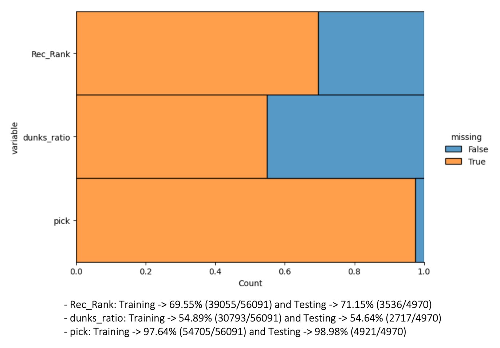

Among the features with missing data, the following three attributes
exhibit notably high levels of missing values, exceeding 50%. Therefore,
it is practical to exclude these features in order to prevent potential
biases in the model arising from imputation.

Given that the remaining features have missing values comprising less
than 2%, it is a reasonable approach to fill these missing values using
the mean for numerical attributes and the mode for categorical
attributes.

-   **Eliminating identifiers.**

Removed unique identifiers namely 'player\_id', 'num', 'team' and 'conf'
as its inclusion in the analysis can lead to overfitting, where the
model fits to these specific values rather than the underlying
generalized patterns in the sportsman's records.

-   **Duplicate records.**

Checked duplicate records is a crucial step in data preprocessing and
quality assurance, ensuring that the analysis is based on reliable and
unbiased data. There were no duplicate data points in the dataset
representing a unique and distinct observation, which is essential for
various analytical tasks.

-   **Feature Engineering - Processing ‘ht’ feature to derive suitable
    information.**

The 'ht' attribute, initially in a date format, represents player
height, vital in basketball. Unique value analysis revealed that 'Jun,'
'Jul,' and 'Aug' don't signify months but likely correspond to heights
like 6 feet, 7 feet, etc. Consequently, these values were converted into
numerical 'ht\_cm' for centimetres as numerical input for machine
learning.

-   **Selecting appropriate features based on the correlation
    coefficient.**

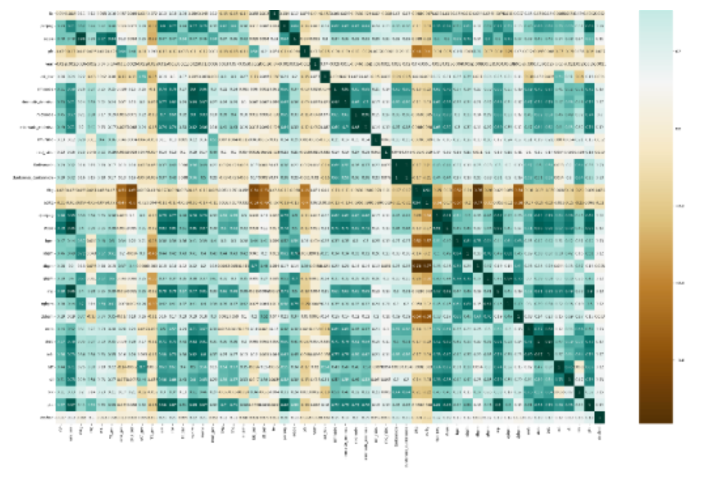Performed correlation analysis to
determine which features would be most valuable for building a
predictive model for the NBA draft prediction task.

-   **Data distribution of various features.**

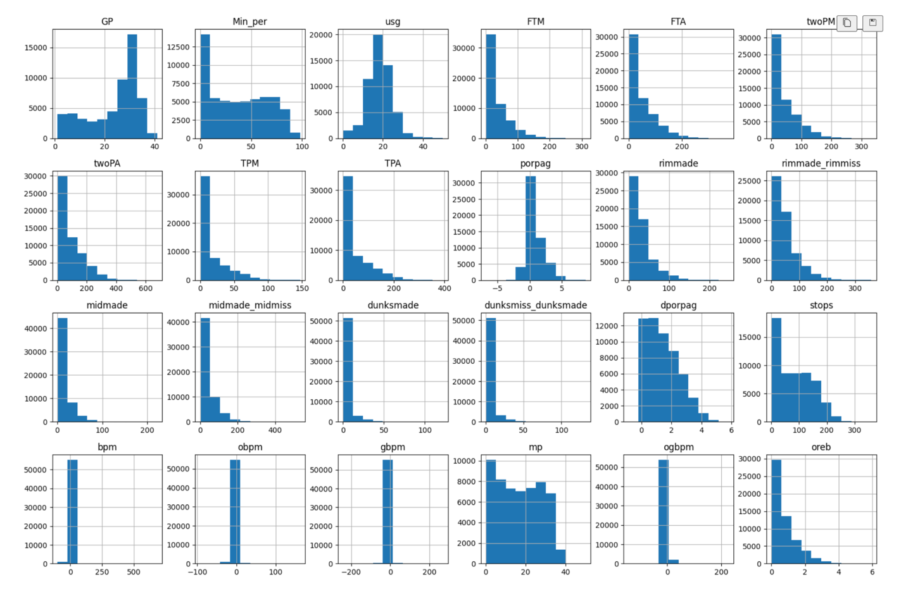

It allows to detect outliers or anomalies in the data and explains
characteristics of your data, such as central tendency, spread, and
shape. Assessing the above chart informs decisions about scaling data
preprocessing steps, as the feature data is present on various scales.

-   **Accessing if imbalance targets classes.**

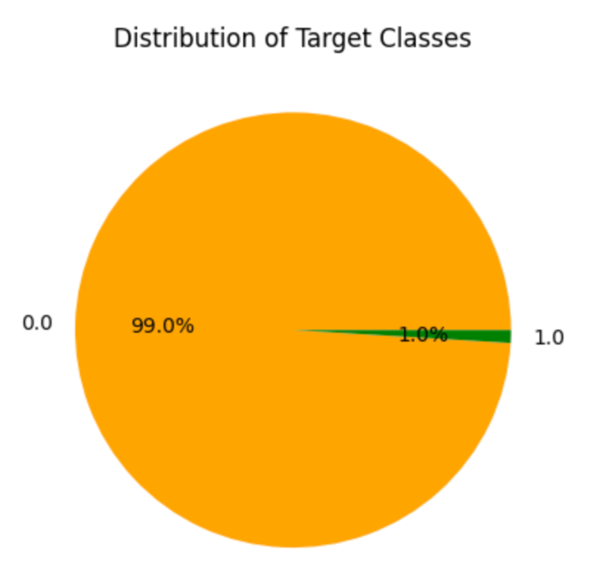

The above pie chart illustrates a significant class imbalance within the
dataset. The majority of observations are attributed to a single target
class, representing players who have not been drafted denoted by the
value 0.

Therefore, performed Oversampling with the SMOTE (Synthetic Minority
Over-sampling Technique) method to address class imbalance by generating
synthetic observations for the minority class representing players who
have been drafted denoted by the value 1.

-   **Features Scaling.**

Using feature scaling prevents the algorithm from prioritizing
high-value features over other more informative ones. It ensures
uniformity in feature values, enabling the algorithm to learn
generalized patterns from all features for accurate player
identification and predictions.

Employed StandardScaler method because it maintains the features data
distribution's shape and retains outliers by scaling data using the mean
of 0 and standard deviation of 1 across the entire dataset, rather than
for individual data points.

## <**<u>Modelling</u>**

As part of the learning process, below are the Classifier models built,
trained, and tested for this binary classification problem.

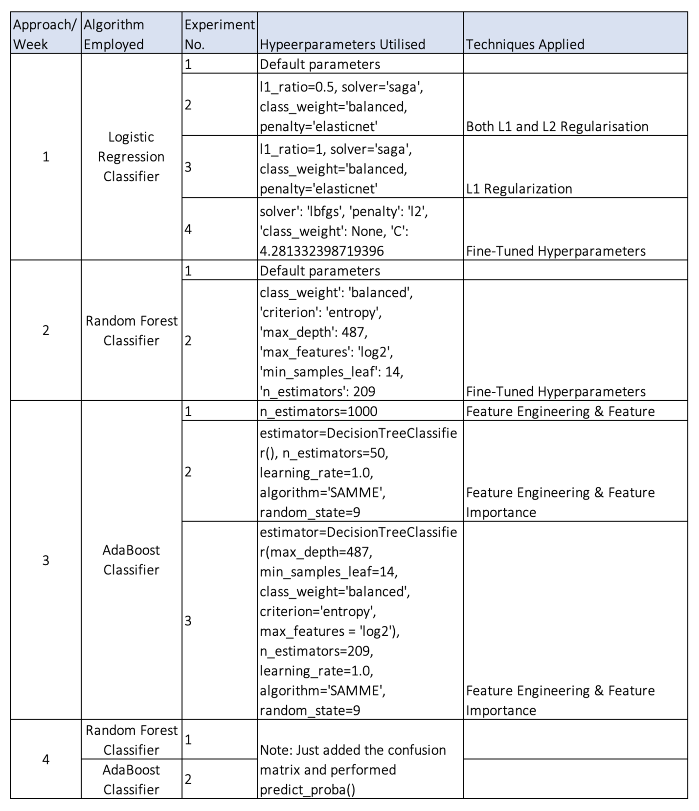

Considering the business objective of determining potential players and
selection, there is no good theory to map and select a suitable
algorithm for this binary classification problem, so different
experiments are performed to discover which algorithm and algorithm
configuration results in the best performance for this binary
classification task.

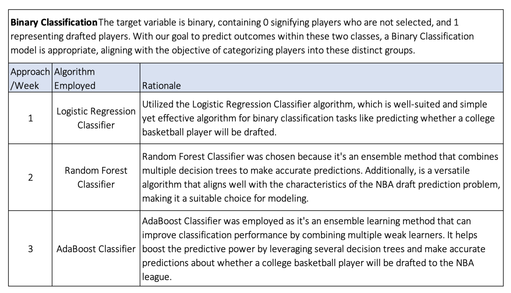

**Hyperparameter Tuning:**

Utilized Hyperparameter Tuning to identify the best hyperparameter
values for the Random Forest Classifier algorithm, addressing the slight
overfitting observed in the model.

Applying the Random Search method for hyperparameter tuning, which
involves incorporating randomness by selecting values from the search
space. This approach can generate various combinations of hyperparameter
values that lead to achieving minimal error. Grid Search's evenly spaced
points may miss optimal hyperparameters.

**Feature Importance:**

Derived feature importance measure that can offer valuable insights into
the players' records, to help comprehend which features have the most
significant impact on the model's predictions to identify prospective
players for selection in the NBA league.

Furthermore, this measure is readily available as the Random Forest
Classifier algorithm computes the change in purity for each feature
during the splitting process. By combining these values for each
feature, the algorithm determines the influence of each feature on
predictions.

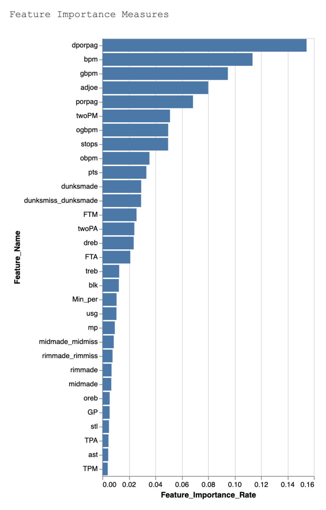

The bar chart above illustrates that the features making the least
contribution include 'TPM', 'ast', 'TPA', 'stl', 'GP', 'oreb',
'midmade', 'rimmade', 'rimmade\_rimmiss', 'midmade\_midmiss', 'mp',
'usg', 'Min\_per', 'blk', 'treb'.

The rest of the features have a significant impact on predicting either
class 1, indicating players selected for the NBA league, or class 0,
representing those not chosen. Their feature importance rates range from
0.02% to 0.15%.

### **<u>Evaluation:</u>**

**Evaluation Metrics:**

The model's performance is assessed using the AUROC (Area Under ROC)
metric, which assesses a model's ability to distinguish between the two
classes (drafted or not drafted) by measuring the trade-off between true
positive rate and false positive rate.

The AUROC metric is relevant because it quantifies the model's
capability to make accurate predictions, which directly aligns with the
project goal of predicting NBA draft outcomes. A higher AUROC indicates
a better ability to differentiate between drafted and non-drafted
players, which is essential for making informed decisions in player
selection.

**Results and Analysis:**

Note: The Notebooks from Week 2nd and Week 3rd are modified
(\*\_Tuned.ipynb) to include a confusion matrix and obtain the
probabilities of target classes on the test dataset using the
predit\_proba() function for the Kaggle result submission. So, the
performance score of only the testing dataset has changed and is
mentioned in the below results tables.

**Week 1:**

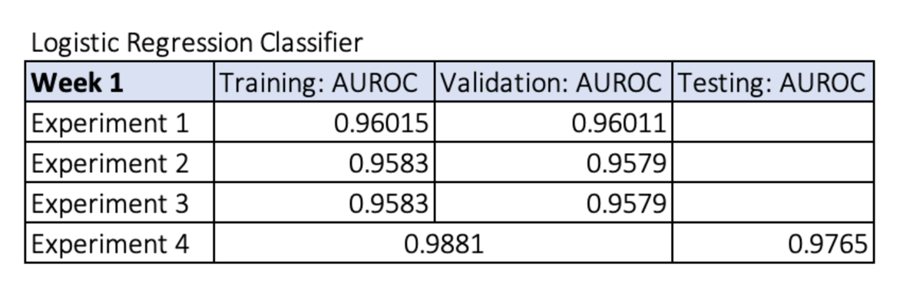

-   In the 1st experiment, the logistic regression algorithm with
    default hyperparameters had the AUROC performance score of 0.96015
    for the training dataset and 0.96011 for the validation dataset,
    indicating that the model is good at identifying players to be
    drafted in the NBA league.

-   Applying regularization techniques, the models from the 2nd and 3rd
    experiments have slightly dropped to the same AUROC performance
    score of 0.9583 for the training dataset and 0.9579 for the
    validation dataset, demonstrating that the model may slightly miss
    some potential players who are likely to be drafted in the NBA
    league in comparison to the 1st experiment's model.

-   With Hyper-tuned parameters in the 4th experiment, the model
    performance has considerably increased to the AUROC score of 0.9881
    and 0.9765 on the testing dataset, illustrating that the model has
    generalized well enough to accurately detect potential players that
    will be drafted on the unseen data.

**Week 2:**

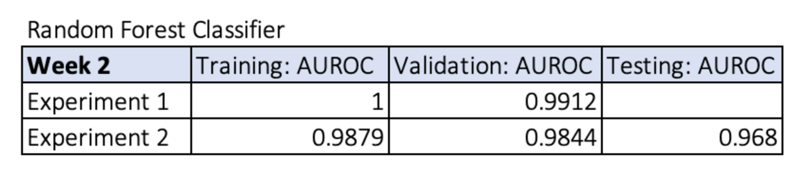

Experiment 2 Confusion Matrix

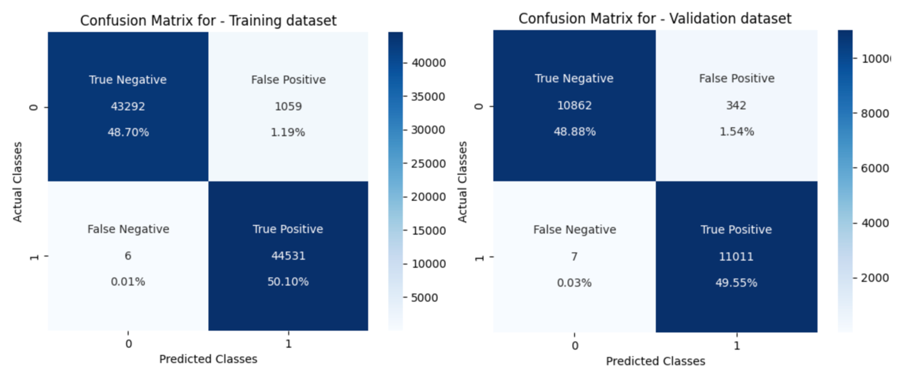

-   From the 1st experiment, the AUROC performance score on the
    validation set 0.9912 is slightly lower compared to the ideal 1.0
    score achieved on the training set, indicating that the model is
    narrowly overfitting.

-   Therefore, in the 2nd experiment, Hyperparameter Tuning was applied
    to identify the best hyperparameter values for the Random Forest
    Classifier algorithm, aiming to mitigate the minor overfitting
    observed in the model.

-   Utilising Hyper tuned parameters in the 2nd experiment, there is a
    slight variation in AUROC scores between training (0.9879),
    validation (0.9844) and testing (0.9680) datasets suggesting that
    the model with optimized hyperparameters is not maintaining
    consistent performance across datasets and is relatively overfitting
    on the unseen data.

-   Additionally, the occurrence of 1059 False Positive in the training
    dataset and 342 in the validation dataset suggests that players who
    should not be selected are mistakenly included in the NBA team which
    might impact the team’s efficiency and shooting goal percentage.

**Week 3:**

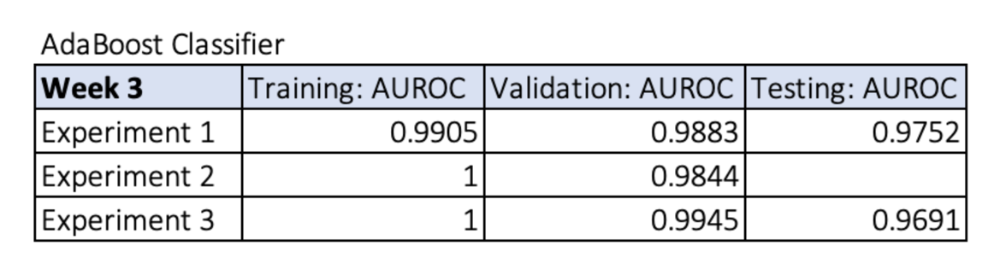

Experiment 1 Confusion Matrix

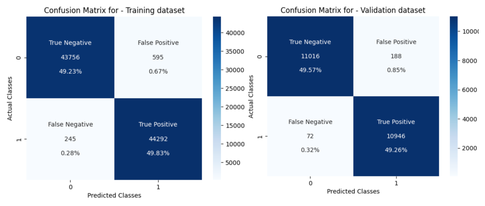

Experiment 3 Confusion Matrix

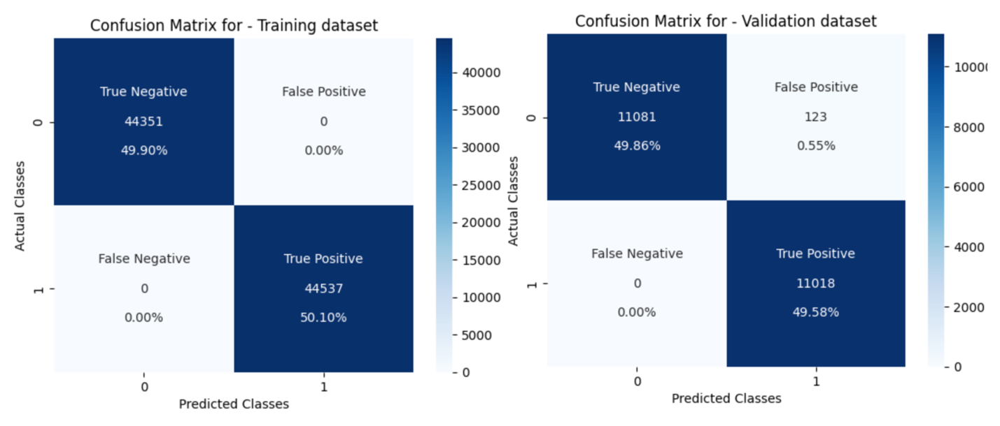

-   In the 1st experiment, the AUROC performance score of 0.9752 on the
    testing set is slightly below the score of 0.9883 and 0.9905
    achieved on the validation and training set, suggesting that the
    model is exhibiting a small degree of overfitting.

-   Furthermore, the relatively high False Positive errors of 595 in the
    training set and 188 in the validation set from the first experiment
    stand out when compared to the False Positive errors from the third
    experiment with 0 for training and 123 for validation.

-   However, the AUROC score from experiment 3 suggests that the model
    is significantly overfitting in comparison to the AUROC score of
    experiment 1 informing that the model has not generalized enough on
    the new unseen data.

Thus, when assessing the performance metrics of all the models in the
experiments conducted over consecutive weeks, the Logistic Regression
Classifier model with tuned hyperparameters from the 4th experiment in
week 1 stands out. It demonstrates better performance compared to the
others, achieving an AUROC score of 0.9881 on cross-validation data and
0.9765 on the testing dataset, which surpasses the performance of models
in other experiments.

Additionally, it suggests that the model is generalised enough on the
unseen data to predict prospective players and could be deployed in the
operational environment.

### **<u>Models Summary and Business Impact and Benefits:</u>**

The Logistic Regression Classifier model (of experiment 4 of week 1)
outperforms other models with a performance score of 0.9881 on training,
and validation data and 0.9765 on the testing data and contributes by
providing relatively highly accurate predictions of whether a college
basketball player will be drafted into the NBA. It helps in solving the
challenge of making informed draft decisions and exploiting the
opportunity to select promising players. The improved accuracy ensures
that the right talent is selected for NBA teams.

The quantifiable improvement in model performance, as demonstrated by
the performance scores, indicates that it adds substantial value to the
draft selection process. The potential value generated includes better
team performance with the selection of more suitable players, increased
fan engagement, and potentially higher revenues for NBA teams.

Below are a few risks from a business point of view.

-   Overfitting: The model may not work well with new data.

-   Data Quality: Inaccurate or biased data may affect predictions.

-   Privacy Concerns: Legal and ethical issues related to player data.

Also, subsequent are some recommendations for business.

-   Regular Model Updates.

-   Improve Data Quality.

-   Ensure Privacy Compliance.

-   Integrate Model into Decision-Making.

-   Collaborate with Experts.

### **<u>Data Privacy and Ethical Concerns:</u>**

-   Data privacy was carefully considered in this project. Since the
    dataset was obtained from a university portal as a student, there
    were no concerns regarding copyright or privacy issues. However, the
    dataset contained unique identifiers like player IDs and numbers,
    which were removed to ensure the privacy of individuals associated
    with the data.

-   Ethical concerns in this project primarily revolve around fairness
    and bias. When using data for predicting NBA draft selections, it's
    crucial to ensure that the model doesn't preserve biases related to
    race, ethnicity, or other factors.

-   Ethical data collection and preprocessing techniques, like removing
    personally identifiable information, were employed to mitigate these
    concerns. Data was used solely for the purpose of predicting NBA
    draft selections, and all efforts were made to ensure fairness,
    transparency, and privacy in the modeling process.

### **<u>Conclusion</u>**

In conclusion, this project successfully achieved its goals by
developing a predictive model for NBA draft selections based on college
basketball player statistics. The Logistic Regression Classifier model
from the 4th experiment in week 1 emerged as the top performer, with
impressive AUROC scores on both cross-validation and testing datasets.

The project's impact on business use cases is significant. It provides
NBA teams with a data-driven tool to make more informed draft
selections, improving their chances of recruiting top talent. It also
aids sports analysts and fans in predicting which college players are
likely to transition to the professional NBA league.

In the future, I would like to explore other techniques like under
sampling, and experimenting with other algorithms, refining the model
further by considering additional features, for optimizing the
predictions. Overall, this project has demonstrated the value of machine
learning in the context of NBA draft selections.

### **Prerequisites**

-   Python 3.7+

-   TensorFlow 2.x

-   Keras

-   scikit-learn

-   OpenCV

-   Matplotlib

• The structure of the project directory is as below.

<small>Project based on the <a target="_blank" href="https://drivendata.github.io/cookiecutter-data-science/">cookiecutter data science project template</a>. #cookiecutterdatascience</small>

Project Organization
------------

    ├── LICENSE
    ├── Makefile           <- Makefile with commands like `make data` or `make train`
    ├── README.md          <- The top-level README for developers using this project.
    ├── data
    │   ├── external       <- Data from third party sources.
    │   ├── processed      <- The intermediate and final datasets for modeling.
    │   └── raw            <- The original, immutable dataset that are downloaded from the souce (canvas).
    │
    ├── models             <- Trained and serialized models, model predictions, or model summaries
    │
    ├── notebooks          <- Jupyter notebooks specified below. 
    │                                MachineLearning-week1_ClassificationModel_LogisticRegression.ipynb
    │                                MachineLearning-week2_ExploratoryDataAnalysis(EDA).ipynb
    │                                MachineLearning-week2_ClassificationModel_RandomForest.ipynb
    │                                MachineLearning-week2_ClassificationModel_RandomForest_Tuned.ipynb
    │                                MachineLearning-week3_ExploratoryDataAnalysis(EDA).ipynb
    │                                MachineLearning-week3_ClassificationModel_AdaBoost.ipynb
    │                                MachineLearning-week3_ClassificationModel_AdaBoost_Tuned.ipynb
    │
    ├── references         <- Data dictionaries or metadata manual.
    │
    ├── reports            <- Generated experiment and analysis reports as below PDF.
    │                                EXPERIMENT REPORT(Week)-1.pdf
    │                                EXPERIMENT REPORT(Week)-2.pdf
    │                                EXPERIMENT REPORT(Week)-3.pdf
    │                                Final Project Report.pdf
    │          
    ├── requirements.txt   <- The requirements file for reproducing the analysis environment, e.g.
    │                         generated with `pip freeze > requirements.txt`
    │
    ├── setup.py           <- makes project pip installable (pip install -e .) so src can be imported
    ├── src                <- Source code for use in this project.
    │   ├── __init__.py    <- Makes src a Python module
    │   │
    │   ├── data           
    │   │   └── sets.py    <- Script with function for data cleaning and processing.
    │   │
    │   │
    │   ├── models         <- Scripts to train models and then use trained models to make
    │      │                  predictions
    │      ├── null.py
    │      └── performance.py
    │
    └── pyproject.toml     <- toml file to manage project configurations and dependencies in Python.

--------

• The subsequent steps to be performed for execution of the project. 

1. Create a new local copy of a remote assignment 1 repository with below command.
    git clone git@github.com:MonaliPatil19/adv_mla_assignment1.git

2. Change the working directory as adv_mla_assignment1.
    cd adv_mla_assignment1

3. Set up a virtual environment, install the required packages using requirement.txt
    pip install -r requirement.txt

3. Install the custom package my-krml-package
   pip install -i https://test.pypi.org/simple/ my-krml-package==0.1.9

4. Execute the EDA notebook for week 2 and week 3. EDA and modeling is in same neetbook for week 1. 
   python Patil_Monali-14370946-week2_EDA.ipynb
   or 
   Patil_Monali-14370946-week3_EDA.ipynb

5. Once EDA for the respective week is completed, execute the modeliing notebook. 
   python Patil_Monali-14370946-week1_LR.ipynb
   or 
   Patil_Monali-14370946-week2_RF.ipynb
   Patil_Monali-14370946-week2_RF_Tuned.ipynb 
   or 
   Patil_Monali-14370946-week3_AdaBoost.ipynb
   Patil_Monali-14370946-week3_AdaBoost_Tuned.ipynb

   Note: The notebooks Patil_Monali-14370946-week*_Tuned.ipynb includes a confusion matrix and the utilization of predict_proba() to estimate the probabilities of target classes on the test dataset, to submitted for the Kaggle competition. 
